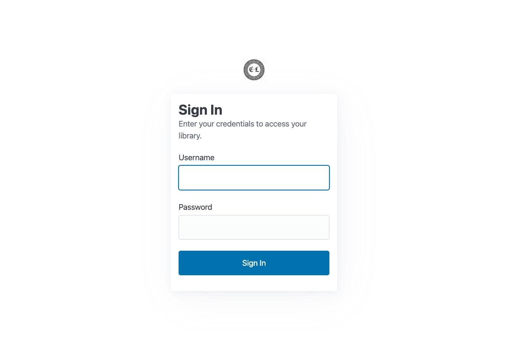
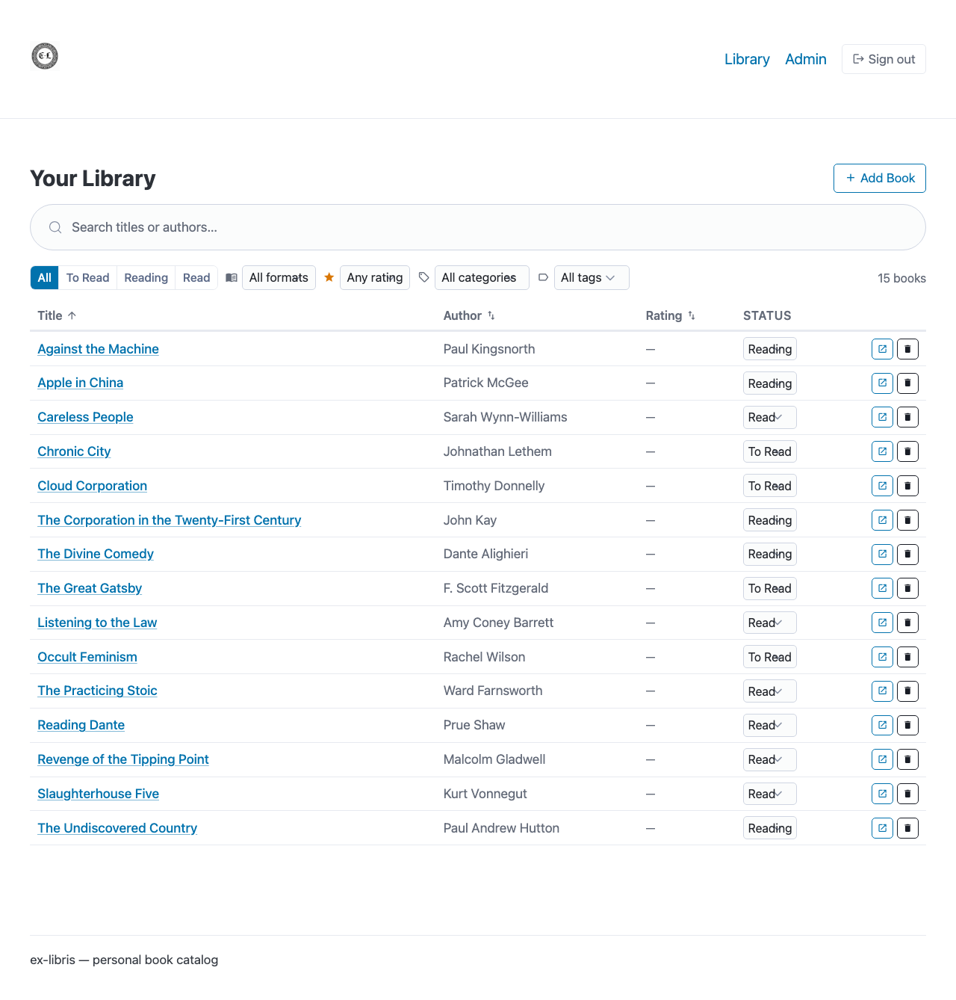
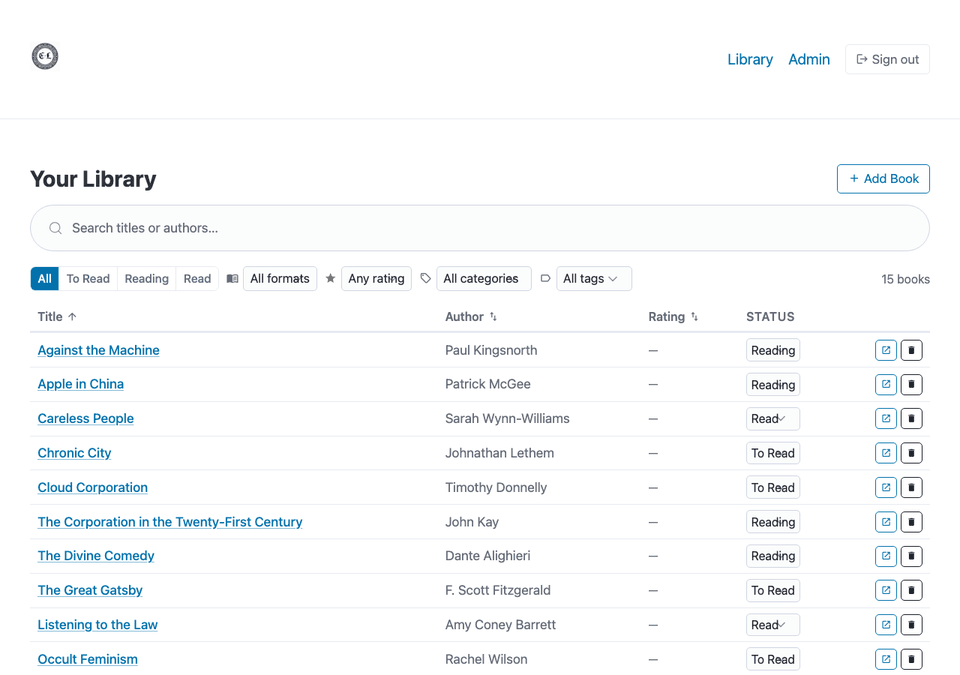
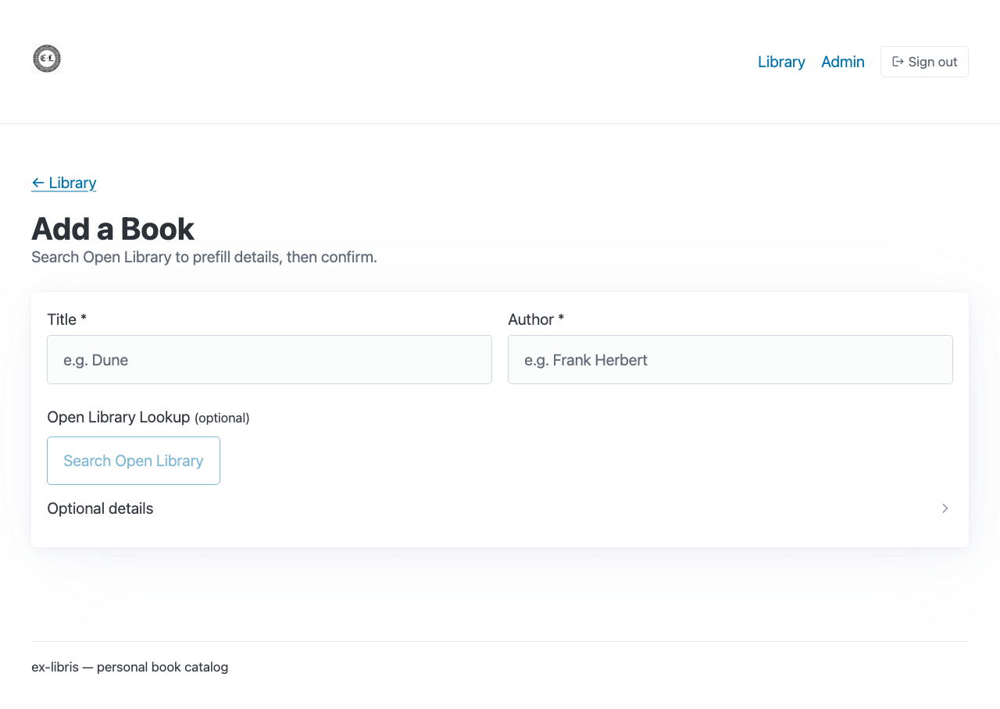
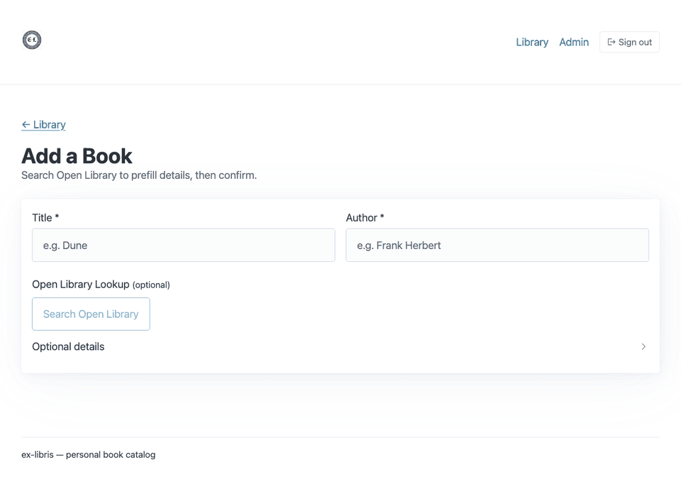
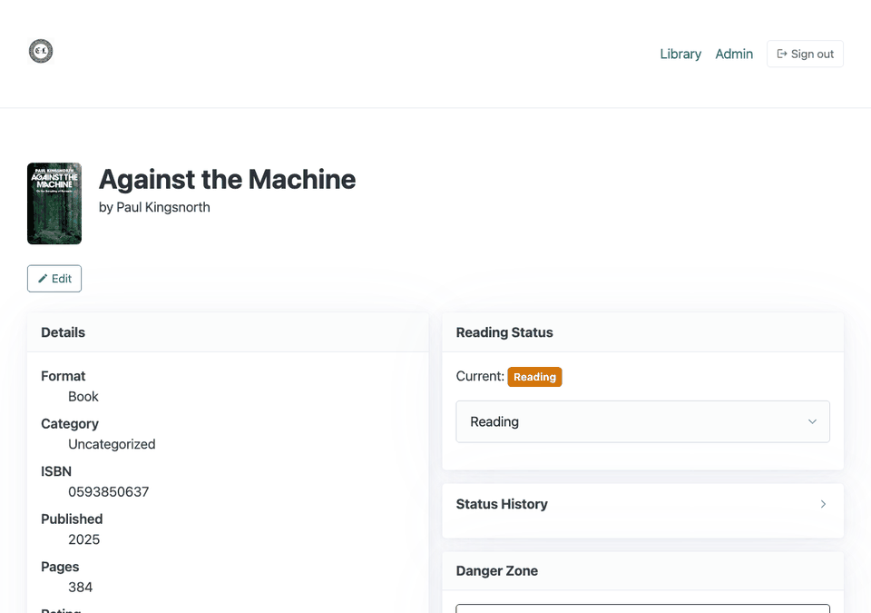
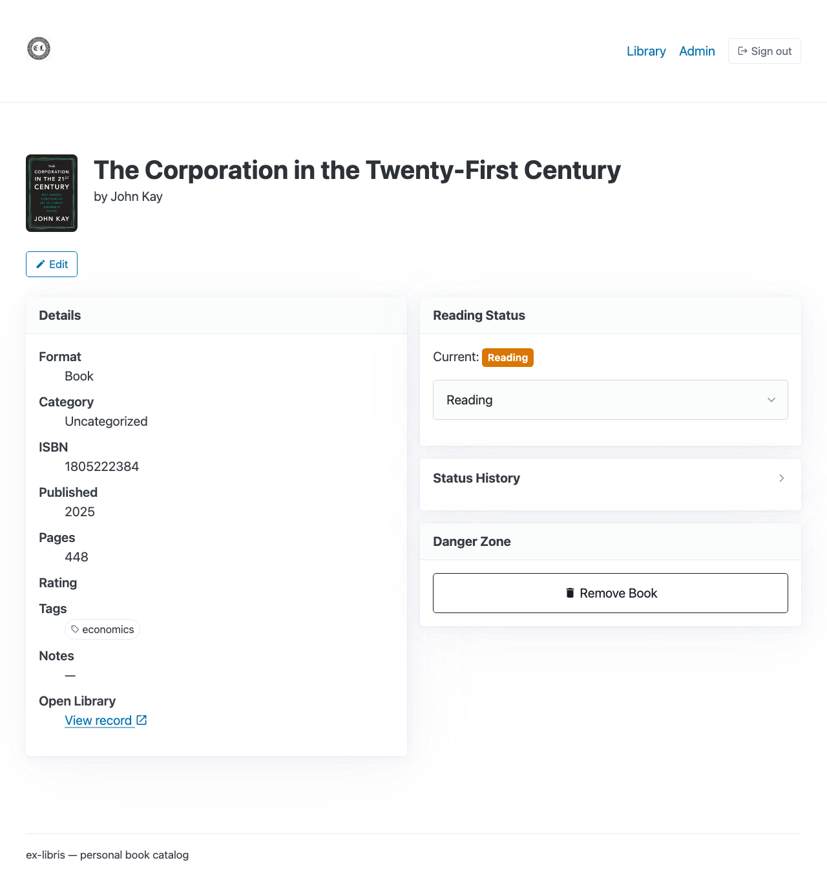
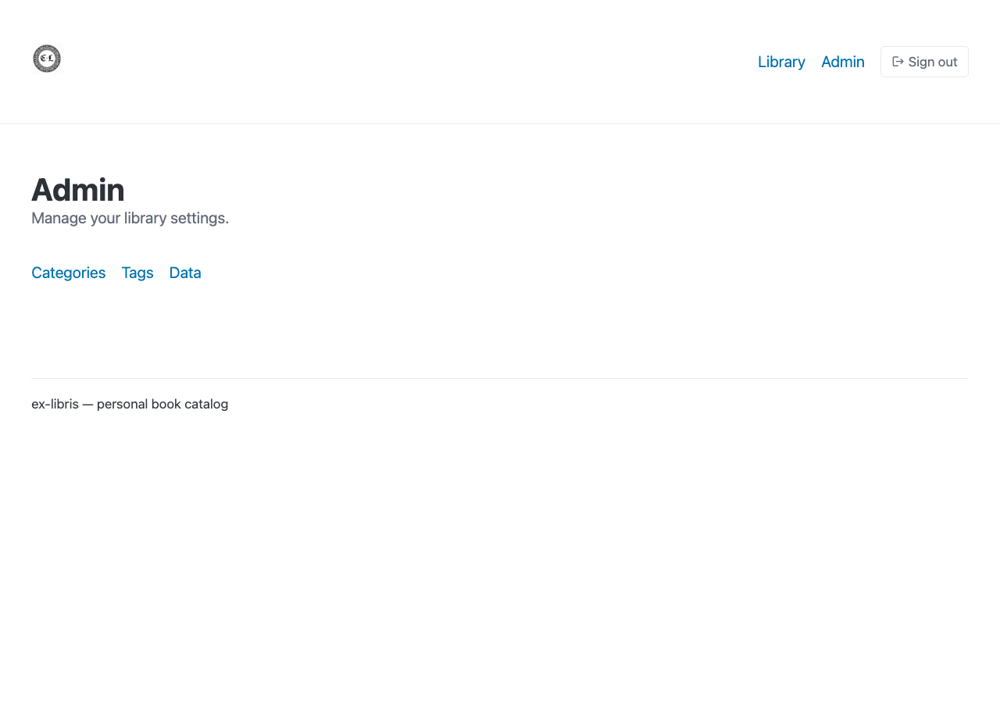
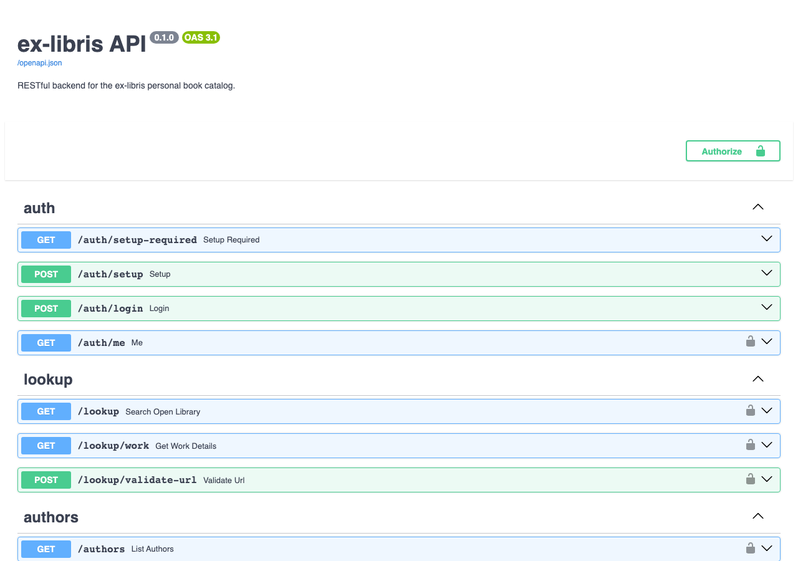

+++
date = '2026-01-24T15:00:37-08:00'
title = 'Ex Libris'
featured = true
summary = '''Self-hosted book catalog and reading tracker built with FastAPI, SQLModel, and Alpine.js in just four days.'''
github_repo = 'https://github.com/abstractionjackson/ex-libris'
[[resources]]
name = 'featured'
src = 'images/branding.png'
+++


I built a private Goodreads alternative over a single long weekend because I wanted a shelf tracker that respected my data and could live alongside the rest of my personal infrastructure. ex-libris is the result: a full-stack app that lets me catalog every book I own, track reading status changes over time, and export everything whenever I want—and all the code lives on [GitHub](https://github.com/abstractionjackson/ex-libris) if you want to run it yourself.

## Why a self-hosted catalog?

Most reading trackers are social networks dressed up as spreadsheets. They optimize for engagement, ads, and algorithmic feeds, not for the tidy, auditable list that a compulsive reader wants. ex-libris keeps everything local—no accounts, no trackers, no third-party APIs owning the source of truth. I can deploy it on a $5 VPS or even my laptop, and because the data sits in SQLite, backups are just a file copy away.

## Architecture cheat sheet

- Backend: FastAPI + SQLModel on Python 3.12, backed by SQLite and Alembic migrations
- CLI: Typer commands that hit the same service layer as the API (`ex-libris add`, `list`, `search`, `status`)
- Frontend: Jinja2 templates served by a lightweight page server plus Alpine.js + Web Components for interactivity
- Auth: Single-user JWT with bcrypt-hashed credentials created during first run
- Media: Cover images downloaded once and served locally; JSON import/export for everything else

## Feature tour

### Private auth at the door



The app is designed for one owner, so the login flow is fast: first run prompts for admin credentials, and every subsequent request carries a JWT. No OAuth dance, no external dependency, just straight ownership.

### Library view built for working collections





The main grid is optimized for the way I actually browse shelves: fuzzy search across titles/authors, filter tabs for All / To Read / Reading / Read, tag and format filters, plus sortable columns. Quick-action buttons let me jump into edit or delete flows with one click. There is also a dedicated “Currently Reading” dashboard powered by the same filters so I can monitor what’s in flight.

### Add books with Open Library in the loop





Enter a title, punch “Search Open Library,” and ex-libris surfaces ranked matches complete with ISBNs, year, page counts, and cover thumbnails. Selecting a result auto-fills the form, saves the cover to local storage, and lets me tag, categorize, and set the initial reading status before the book ever hits the shelf.

### Book detail plus reading timeline





Every status change creates an audit entry, so the detail view doubles as a reading log. I can see when I picked something up, when it stalled, when I finished, and any notes I left during edits. Inline editing keeps me in the flow, while the danger zone gives me a deliberate two-step delete.

### Admin panel, API, and CLI working together





The admin surface handles taxonomy management plus JSON import/export flows. Under the hood there is a full REST API (documented live with Swagger) that powers both the browser UI and the Typer CLI. Running the CLI feels the same as poking the API:

```
ex-libris add "Dune" --author "Frank Herbert"
ex-libris list --status reading
ex-libris status "Dune" read
```

Because the CLI and web app share the same service layer, adding automations (like syncing recent reads to my personal site) is trivial.

## Four intense days of building

**Day 1 — Foundation + Open Library** (`2c14ba9`, `63b00d0`, `805f884`, `bb01c86`): Bootstrapped the Typer CLI, wired up Open Library search, persisted metadata (ISBN, year, pages, cover URL), and stood up a FastAPI REST service with CRUD endpoints.

**Day 2 — Web frontend + reading status** (`6dddcf3`, `52557e3`, `3d82064`, `132a785`): Added the `StatusUpdate` model for historical tracking, scaffolded the Jinja2 + Alpine.js frontend, and shipped the core pages (library, detail, add, cover rendering) with plenty of bug fixes.

**Day 3 — Auth + tags** (`3879dc1`, `5ac17fd`, `a9baea9`, `faf2522`): Locked the app down with JWT auth, built the tag editing UI with comma-separated input that auto-creates tokens, and prepped for deployment.

**Day 4 — Covers, import/export, polish** (`9383ffd`, `8c56af0`, `78aac71`, `20dab1b`, `af821a9`): Started storing covers locally, finalized JSON import/export (idempotent by ISBN or title+author), and added admin tooling plus initial status selection on book creation.

## Technical decisions that paid off

1. SQLModel means the same dataclass drives persistence and FastAPI responses, so there’s no hand-written schema layer to drift.
2. Alpine.js + Web Components keep the frontend dependency-free—no bundler, no npm install, just HTML with a sprinkle of reactive behavior.
3. A separate page server renders shell templates while the API remains stateless JSON. That separation lets me deploy or test each piece independently.
4. Cover images are cached locally with hashed filenames, so Open Library outages never break the UI and duplicate downloads disappear.
5. The import pipeline is idempotent. Replaying the same export is safe, which makes backups and environment refreshes trivial.

## What’s next

I’m wiring ex-libris into my personal site as a “currently reading” widget and exploring a Fly.io or Cloudflare Tunnel deployment for zero-maintenance hosting. Longer term I want to expose curated reading lists via the API and let the CLI push finished books to my newsletter workflow. If you want a walkthrough or would like to self-host it yourself, reach out—I’m happy to share the repo and deployment recipe.
